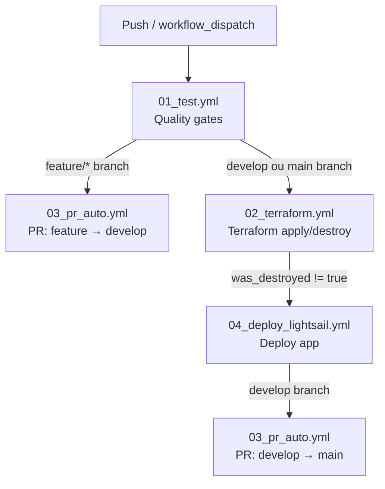

# Pipeline CI/CD — Documentação do Fluxo

## Visão Geral

O pipeline automatiza as seguintes etapas a cada push no repositório:

1. **Qualidade**: lint, type check, segurança e cobertura de testes
2. **Infraestrutura**: provisiona ou destrói recursos AWS via Terraform
3. **Deploy**: publica a aplicação FilmBot no Lightsail
4. **Promoção**: cria PRs automáticos entre branches (`feature → develop → main`)

---

## Diagrama de Fluxo



---

## Triggers

| Evento | Branch | Workflows executados |
|---|---|---|
| `push` | `feature/*` | test → PR feature→develop |
| `push` | `develop` | test → terraform (dev) → deploy (dev) → PR develop→main |
| `push` | `main` | test → terraform (prod) → deploy (prod) |
| `workflow_dispatch` | qualquer | test → terraform → deploy (ambiente escolhido) |

---

## Workflows

### `00_pipeline.yml` — Orquestrador

Ponto de entrada do pipeline. Não executa lógica diretamente; apenas chama os outros workflows na ordem certa usando `needs:` e condicionais de branch.

**Lógica de ambiente:**

| Branch | Ambiente |
|---|---|
| `develop` | `dev` |
| `main` | `prod` |
| `workflow_dispatch` | escolha manual |

---

### `01_test.yml` — Quality Gates

Valida a qualidade do código antes de qualquer deploy.

| Etapa | Ferramenta | Comportamento |
|---|---|---|
| Lint | Ruff | **Bloqueia** se falhar |
| Cobertura de testes | pytest-cov | **Bloqueia** se < 70% |
| Type check | mypy | Aviso (não bloqueia) |
| Segurança do código | Bandit | Aviso (não bloqueia) |
| Vulnerabilidades em deps | Safety | Aviso (não bloqueia) |

---

### `02_terraform.yml` — Infraestrutura

Provisiona ou destrói a infraestrutura AWS.

**Entrada:** `environment` (`dev` ou `prod`)  
**Saída:** `was_destroyed` — indica se a infra foi destruída (impede o deploy)

**`infra/destroy_config.json`**

Controla se o workflow deve destruir (`terraform destroy`) ou provisionar (`terraform apply`) cada ambiente:

```json
{ "dev": false, "prod": false }
```

Mudar um valor para `true` faz com que o próximo push naquele ambiente execute `terraform destroy` em vez de `terraform apply`. Após a destruição, o valor **não é revertido automaticamente** — é necessário mudar de volta para `false` e fazer novo push para reaplicar a infraestrutura.

**Etapas principais:**

1. Build do pacote Lambda (`infra/scripts/build_lambda_package.py`)
2. Lê `infra/destroy_config.json` para decidir se destrói ou aplica
3. `terraform init` com backend S3 + DynamoDB
4. `terraform validate` + TFLint + fmt check + Checkov (todos não-bloqueantes)
5. Injeta o e-mail de notificação no `.tfvars` (não é commitado no repo)
6. `terraform destroy` **ou** `terraform plan` + Infracost + `terraform apply`

**Autenticação AWS:** OIDC (sem chaves estáticas)

---

### `03_pr_auto.yml` — PR Automático

Cria ou atualiza um Pull Request para promover código entre branches.

**Entrada:** `branch_name` (branch de origem)

| Branch de origem | Branch de destino |
|---|---|
| `feature/*` | `develop` |
| `develop` | `main` |

Antes de criar o PR, executa `terraform validate -backend=false` para garantir que o código Terraform é válido.

---

### `04_deploy_lightsail.yml` — Deploy da Aplicação

Publica a aplicação Streamlit (FilmBot) na instância Lightsail via SSH.

**Entrada:** `environment` (`dev` ou `prod`)

**Etapas principais:**

1. Lê outputs do Terraform (IP, chave SSH, credenciais AWS do FilmBot)
2. Configura SSH com retry (até 12 tentativas, intervalo de 10s)
3. Cria `.env` na instância com variáveis de ambiente da aplicação
4. Cria `secrets.toml` do Streamlit com a senha de acesso
5. Deploy por SSH:
   - **Primeiro deploy**: clone do repo, venv, systemd service
   - **Updates**: git pull, pip install, restart do service
6. Expõe a aplicação em `http://<ip>:8501`

**Branch deployada por ambiente:**

| Ambiente | Branch |
|---|---|
| `dev` | `develop` |
| `prod` | `main` |

---

## Promoção de Branches

```
feature/minha-feature
        ↓  (PR automático após testes passarem)
      develop
        ↓  (PR automático após deploy dev bem-sucedido)
        main
```

Cada promoção é feita via PR automático criado pelo `03_pr_auto.yml`. O merge ainda requer aprovação manual.

---

## Secrets e Variáveis

| Secret | Ambiente | Uso |
|---|---|---|
| `AWS_ASSUME_ROLE_ARN_DEV` / `_PROD` | dev / prod | OIDC — autenticação AWS |
| `AWS_STATEFILE_S3_BUCKET_DEV` / `_PROD` | dev / prod | Backend Terraform (estado) |
| `AWS_LOCK_DYNAMODB_TABLE_DEV` / `_PROD` | dev / prod | Lock do estado Terraform |
| `AWS_TMDB_SECRET_ARN_DEV` / `_PROD` | dev / prod | ARN do segredo da API TMDB |
| `NOTIFICATION_EMAIL` | ambos | E-mails de alerta da infra |
| `INFRACOST_API_KEY` | ambos | Estimativa de custo no PR |
| `OPENAI_API_KEY` | ambos | LLM no FilmBot (Lightsail) |
| `FILMBOT_PASSWORD` | ambos | Autenticação no Streamlit |
