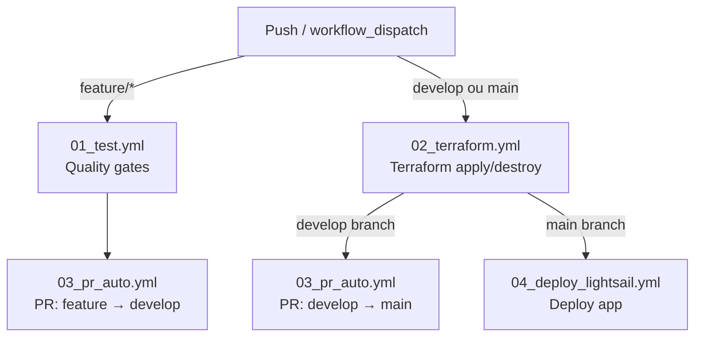

# Pipeline CI/CD — Documentação do Fluxo

## Visão Geral

O pipeline automatiza as seguintes etapas a cada push no repositório:

1. **Qualidade**: lint, type check, segurança e cobertura de testes
2. **Infraestrutura**: provisiona ou destrói recursos AWS via Terraform
3. **Deploy**: publica a aplicação FilmBot no Lightsail
4. **Promoção**: cria PRs automáticos entre branches (`feature → develop → main`)

---

## Diagrama de Fluxo



---

## Triggers

| Evento | Branch | Workflows executados |
|---|---|---|
| `push` | `feature/*` | test → PR feature→develop |
| `push` | `develop` | terraform (dev) → PR develop→main |
| `push` | `main` | terraform (prod) → deploy (prod) |
| `workflow_dispatch` | — | terraform (dev **ou** prod) → deploy apenas se ambiente = prod |

---

## Workflows

### `00_pipeline.yml` — Orquestrador

Ponto de entrada do pipeline. Não executa lógica diretamente; apenas chama os outros workflows na ordem certa usando `needs:` e condicionais de branch.

**Lógica de ambiente:**

| Branch | Ambiente |
|---|---|
| `develop` | `dev` |
| `main` | `prod` |
| `workflow_dispatch` | escolha manual |

---

### `01_test.yml` — Quality Gates

Valida a qualidade do código antes de qualquer deploy. Executa **apenas em branches `feature/*`**.

| Etapa | Ferramenta | Comportamento |
|---|---|---|
| Lint | Ruff | **Bloqueia** se falhar |
| Cobertura de testes | pytest-cov | **Bloqueia** se < 80% |
| Type check | mypy | Aviso (não bloqueia) |
| Segurança do código | Bandit | Aviso (não bloqueia) |
| Vulnerabilidades em deps | Safety | Aviso (não bloqueia) |

---

### `02_terraform.yml` — Infraestrutura

Provisiona ou destrói a infraestrutura AWS.

**Entrada:** `environment` (`dev` ou `prod`)  
**Saída:** `was_destroyed` — indica se a infra foi destruída (impede o deploy)

**`infra/config/destroy_config.json`**

Controla se o workflow deve destruir (`terraform destroy`) ou provisionar (`terraform apply`) cada ambiente:

```json
{ "dev": false, "prod": false }
```

Mudar um valor para `true` faz com que o próximo push naquele ambiente execute `terraform destroy` em vez de `terraform apply`. Após a destruição, o valor **não é revertido automaticamente** — é necessário mudar de volta para `false` e fazer novo push para reaplicar a infraestrutura.

**Etapas principais:**

1. Build do pacote Lambda (`infra/scripts/build_lambda_package.py`) e wheels Glue (ETL, Agg, Details) — verifica se os artefatos foram gerados
2. Lê `infra/config/destroy_config.json` para decidir se destrói ou aplica — valida que o valor é `true` ou `false`
3. `terraform init` com backend S3 + DynamoDB
4. `terraform validate` e `terraform fmt -check` (**bloqueantes**) + TFLint e Checkov (não-bloqueantes — apenas avisos)
5. Injeta o e-mail de notificação no `.tfvars` (não é commitado no repo)
6. **Bootstrap das IAM policies** — aplica com `-target` as 6 policies do CI/CD antes do plan principal, resolvendo o problema de bootstrap (a role precisa das policies para gerenciar os recursos, mas as policies são criadas pelo mesmo Terraform). Idempotente — se as policies já existem, é um no-op. Verifica via polling (a cada 5s, timeout 60s) com `aws iam list-attached-role-policies` se as 6 policies estão de fato attachadas à role — falha o pipeline se alguma estiver ausente
7. `terraform destroy` **ou** `terraform plan` + Infracost + `terraform apply`

**Autenticação AWS:** OIDC — assume a role `lsg-github-actions-{env}` com políticas de privilégio mínimo gerenciadas pelo Terraform (`iam_cicd.tf`). As variáveis `cicd_statefile_s3_bucket` e `cicd_lock_dynamodb_table` são passadas via `-var` a partir dos secrets `aws-statefile-s3-bucket` e `aws-lock-dynamodb-table`.

---

### `03_pr_auto.yml` — PR Automático

Cria ou atualiza um Pull Request para promover código entre branches.

**Entrada:** `branch_name` (branch de origem)

| Branch de origem | Branch de destino |
|---|---|
| `feature/*` | `develop` |
| `develop` | `main` |

Antes de criar o PR, executa `terraform validate -backend=false` e `terraform fmt -check` — apenas em branches `feature/*`. Em `develop`, esses checks são pulados porque o `02_terraform.yml` já os executou antes do auto-pr ser chamado.

---

### `04_deploy_lightsail.yml` — Deploy da Aplicação

Publica a aplicação Streamlit (FilmBot) na instância Lightsail via SSH. Executa **apenas em `main`** (ou `workflow_dispatch` com ambiente `prod`) — o ambiente `dev` não possui instância Lightsail.

**Entrada:** `environment` (`prod`)

**Etapas principais:**

1. Lê outputs do Terraform (IP, chave SSH, credenciais AWS do FilmBot, nome da instância) — valida que nenhum output crítico está vazio
2. Verifica o estado da instância via `aws lightsail get-instance` — se não estiver `running` (ex: parada pelo scheduler noturno), **pula os steps de deploy** com warning (mas ainda exibe a URL do app no final)
3. Configura SSH com retry (até 30 tentativas, intervalo de 10s) — falha o pipeline se SSH não ficar disponível em 5 minutos
4. Cria `.env` na instância com variáveis de ambiente da aplicação — verifica via SSH se o arquivo foi criado
5. Cria `secrets.toml` do Streamlit com a senha de acesso — verifica via SSH se o arquivo foi criado
6. Instala o Caddy como proxy reverso HTTPS (se ainda não instalado)
7. Deploy por SSH:
   - **Primeiro deploy**: clone do repo, venv, systemd services (filmbot + caddy)
   - **Updates**: git pull, pip install, restart de ambos os services
   - Verifica se os serviços `filmbot` e `caddy` estão ativos (`systemctl is-active`) — falha o pipeline se algum estiver inativo
8. Health check — aguarda 30s e faz `curl` no IP público para confirmar que o app está respondendo
9. Exibe a URL do FilmBot no log e no Job Summary (clicável)

**Branch deployada por ambiente:**

| Ambiente | Branch |
|---|---|
| `dev` | `develop` |
| `prod` | `main` |

---

## Promoção de Branches

```
feature/minha-feature
        ↓  (PR automático após testes passarem)
      develop
        ↓  (PR automático após terraform dev bem-sucedido)
        main
```

Cada promoção é feita via PR automático criado pelo `03_pr_auto.yml`. O merge ainda requer aprovação manual.

---

## Secrets e Variáveis

| Secret | Ambiente | Uso |
|---|---|---|
| `AWS_ASSUME_ROLE_ARN_DEV` / `_PROD` | dev / prod | OIDC — autenticação AWS |
| `AWS_STATEFILE_S3_BUCKET_DEV` / `_PROD` | dev / prod | Backend Terraform (estado) |
| `AWS_LOCK_DYNAMODB_TABLE_DEV` / `_PROD` | dev / prod | Lock do estado Terraform |
| `AWS_TMDB_SECRET_ARN_DEV` / `_PROD` | dev / prod | ARN do segredo da API TMDB |
| `NOTIFICATION_EMAIL` | ambos | E-mails de alerta da infra |
| `INFRACOST_API_KEY` | ambos | Estimativa de custo no PR |
| `LLM_API_KEY` | ambos | LLM no FilmBot (Lightsail) |
| `FILMBOT_PASSWORD` | ambos | Autenticação no Streamlit |

---

## Glossário técnico

| Termo | O que é |
|---|---|
| **OIDC** | Método de autenticação sem chaves estáticas. O GitHub Actions prova sua identidade para a AWS via token temporário — mais seguro que guardar `AWS_ACCESS_KEY` em secrets. |
| **Backend Terraform** | Local onde o Terraform guarda o *state file* — arquivo que mapeia o que foi criado na AWS. Aqui é um bucket S3 com lock via DynamoDB para evitar conflito quando duas pessoas rodam o Terraform ao mesmo tempo. |
| **ARN** | Amazon Resource Name — identificador único de qualquer recurso AWS (ex: `arn:aws:secretsmanager:us-east-1:123456:secret:tmdb-key`). |
| **TFLint** | Linter para código Terraform — detecta erros de configuração e boas práticas sem precisar aplicar nada na AWS. |
| **Checkov** | Scanner de segurança para IaC (Terraform, CloudFormation) — detecta configurações inseguras como buckets S3 públicos ou IAM permissivo demais. |
| **Infracost** | Estima o custo mensal da infraestrutura AWS antes de aplicar — exibe o delta de custo no comentário do PR. |
| **PR automático** | Pull Request criado pelo próprio pipeline (`03_pr_auto.yml`) para promover código entre branches. O merge ainda requer aprovação manual, mas a criação do PR é automatizada para não depender de nenhum desenvolvedor. |
| **`terraform destroy`** | Destrói todos os recursos AWS gerenciados pelo Terraform naquele ambiente — o inverso do `apply`. Usado para desligar o ambiente e parar de pagar. Controlado pelo `infra/config/destroy_config.json`. |
